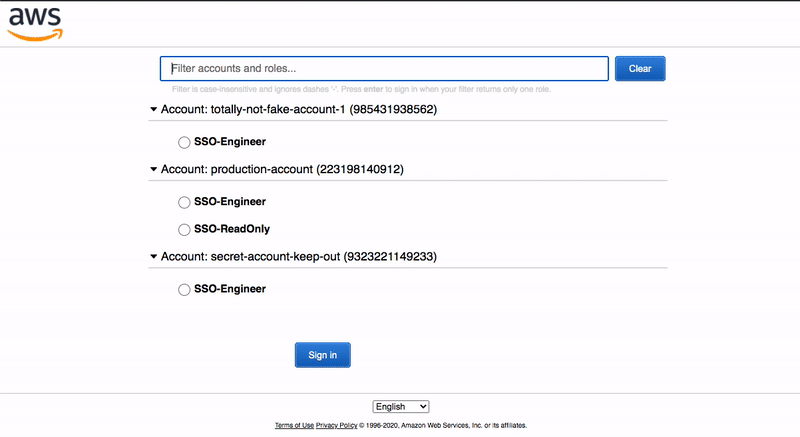

# AWS SAML SSO Filter Userscript

A userscript to enhance the AWS SAML SSO Sign-in page. 

Adds the following features:
- Filter both roles and accounts (case insensitive and strips dashes)
- Auto-select matching role when your filter is specific enough, sign-in to that account by pressing enter
- Keyboard navigation, press down from the search box to begin selecting roles, press enter to sign-in
- Automatically sign-in to roles when selecting accounts with the mouse

## How to install
You will need to install a userscript engine such as Tampermonkey. This script has been tested in Tampermonkey for Chrome and Firefox.

[Tampermonkey Chrome](https://chrome.google.com/webstore/detail/tampermonkey/dhdgffkkebhmkfjojejmpbldmpobfkfo?hl=en) (free)

[Tampermonkey Firefox](https://addons.mozilla.org/en-US/firefox/addon/tampermonkey/) (free)

[Tampermonkey Safari](https://apps.apple.com/us/app/tampermonkey/id1482490089?mt=12) (AU$2.99/US$1.99)

Once you have Tampermonkey installed, click the link below to install the script.

[Click to install!](https://raw.githubusercontent.com/renkoh/aws-saml-filter-userscript/master/aws-saml-filter.user.js)

### Credits

Thanks to the following gists used as a base:

https://gist.github.com/martinlindenberg/3c4a0ca6b2e47dfdc156e0355634f82c
https://gist.github.com/AdrianAcala/f6f32a0e9e0cab7d1220e41ad84dd494